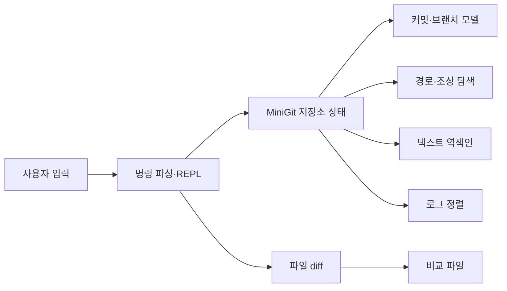

# 버전 관리 시뮬레이터

## 프로젝트 소개

메모리 안에서 커밋·브랜치·이력 탐색을 구현한 Python REPL입니다. 커밋 그래프, 역색인 검색, 직접 구현한 정렬 알고리즘을 통해 버전 관리의 데이터 모델을 학습합니다.

## 핵심 특징

- 저장소 초기화, 커밋 생성, 브랜치 생성·전환
- 부모가 자식보다 먼저 나오는 이력 출력
- 날짜·작성자 기준 정렬과 키워드·작성자 검색
- 커밋 간 경로와 조상 탐색
- 파일 diff, 병합 커밋, 정렬 성능 비교

## 아키텍처

`REPL → 명령 실행기 → MiniGit → 커밋 그래프·역색인·정렬` 흐름입니다. 브랜치는 커밋 ID를 가리키며 새 커밋은 기존 부모만 참조합니다.

| 경로 | 역할 |
| --- | --- |
| `src/minigit/__main__.py` | 실행 진입점 |
| `src/minigit/cli.py` | 명령 파싱과 REPL |
| `src/minigit/repository.py`, `models.py` | 저장소 상태와 커밋 모델 |
| `src/minigit/sorting.py`, `text_index.py`, `diff_utils.py` | 정렬·검색·diff |
| `examples/diff/` | 파일 비교용 원본 샘플 |
| `docs/design.md` | 커밋 모델·탐색·검색·정렬의 설계 결정 |



소스는 `src/minigit/`, 회귀 테스트는 `tests/`, 개발 보조 도구는 `scripts/`에 둡니다. `pyproject.toml`이 패키지·명령·개발 도구를 선언하고 `uv.lock`이 설치 버전을 고정합니다. `uv sync --frozen`은 소스를 개발 모드로 설치하므로 앱 실행과 테스트에 별도 `PYTHONPATH` 설정이 필요하지 않습니다.

## 실행 환경과 시작하기

Python 3.10 이상과 uv가 필요합니다. 앱 런타임은 표준 라이브러리만 사용합니다. 저장소 루트에서 실행합니다.

```bash
uv sync --frozen
uv run --frozen mini-git
```

REPL에서 다음 명령을 입력합니다.

```text
init "사용자"
commit "첫 기록"
branch feature
switch feature
commit "검색 기능"
log
search 검색
switch main
merge feature
diff examples/diff/a.txt examples/diff/b.txt
quit
```

## 명령과 동작 범위

`log --sort-by=date`, `log --sort-by=author`, `search --author=이름`, `path <ID1> <ID2>`, `ancestors <ID>`, `bench-sort [크기]`를 지원합니다. 명령 이름은 대소문자를 구분하지 않습니다.

커밋 ID는 세션 안에서 순서대로 생성합니다. 실제 Git 저장소나 작업 트리를 관리하지 않으며 종료하면 이력은 사라집니다. `path`는 부모 연결을 양방향으로 탐색합니다. 병합은 이력 그래프 실습이며 실제 Git의 파일 병합·충돌 처리와 동일하지 않습니다.

## 검증

```bash
make check
make test
make smoke
make build
```

별도 REPL 프로세스에서 초기화·커밋·브랜치·검색·경로·병합·diff를 확인합니다.

`make check`는 정적 분석·포맷·문서 검사를, `make test`는 `uv run --frozen pytest -q`로 등록된 회귀 테스트를 실행합니다. 그래프·초기화 색인 리셋, 정렬 옵션과 안정성, 작성자 검색, benchmark 출력, 잘못된 명령·빈 브랜치 병합 시 이력 보존을 검증합니다. `make smoke`는 `smoke` 마커가 붙은 실제 REPL 프로세스의 명령 흐름·diff 변경 줄·없는 파일 오류 후 계속 실행을 선택합니다(`uv run --frozen pytest -q -m smoke`). 실제 Git 저장소나 외부 서비스는 사용하지 않으며 benchmark 시간의 우열을 보장하는 테스트도 아닙니다.

## 상세 문서

[모델 설계](docs/design.md)에서 그래프 방향, 검색 비용, 정렬 기준과 구현 경계를 설명합니다.
